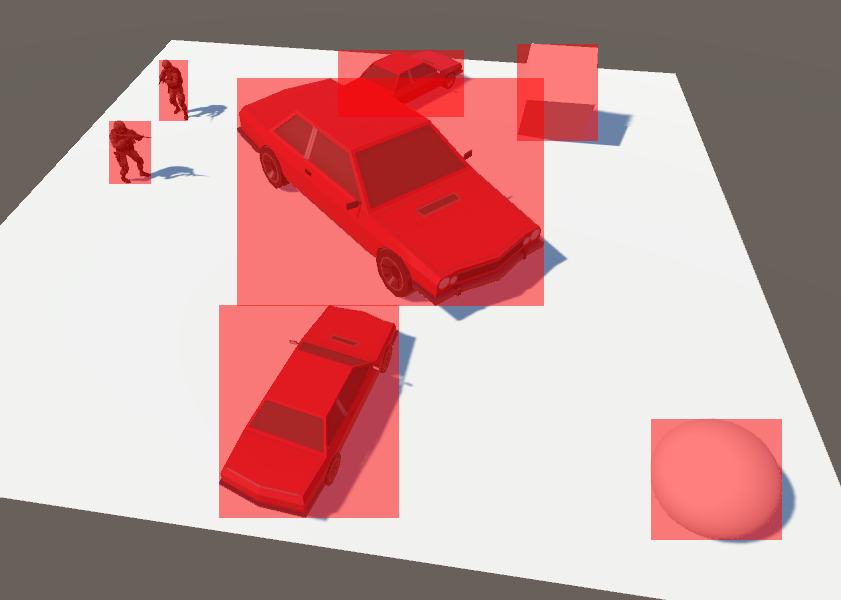
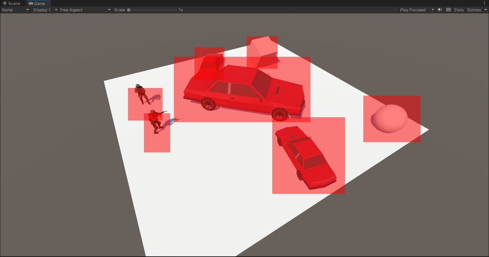
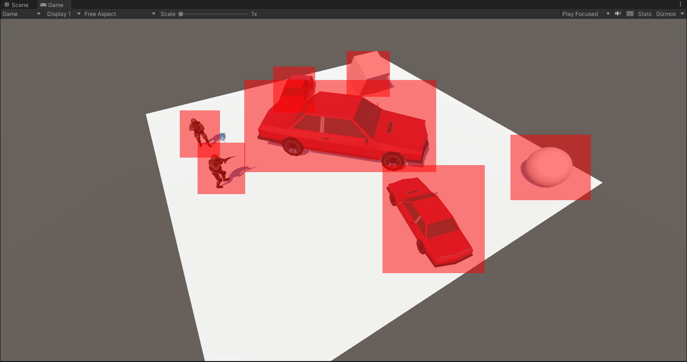
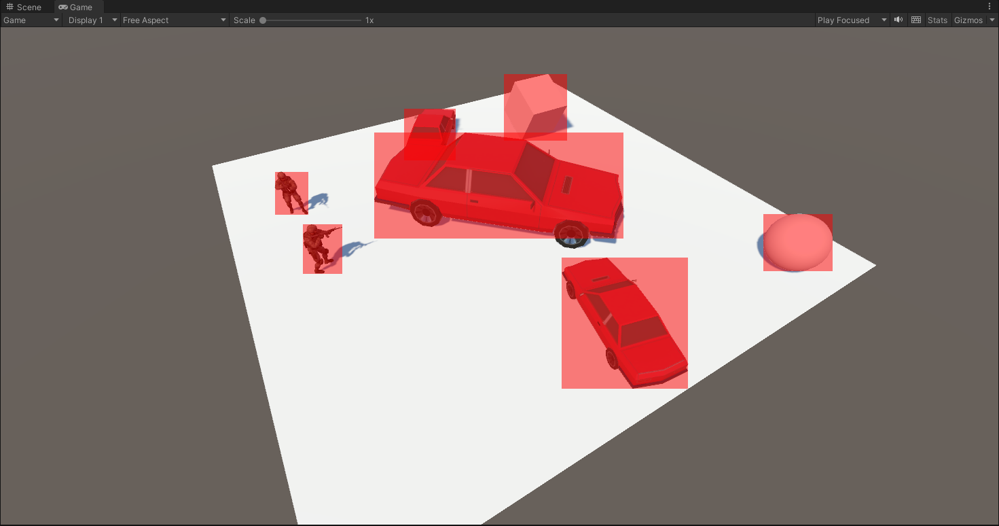
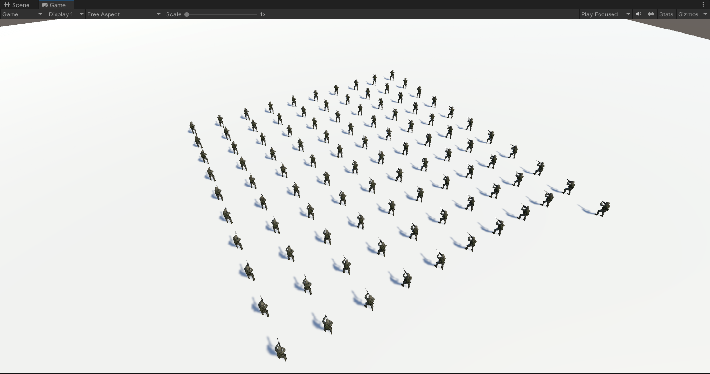
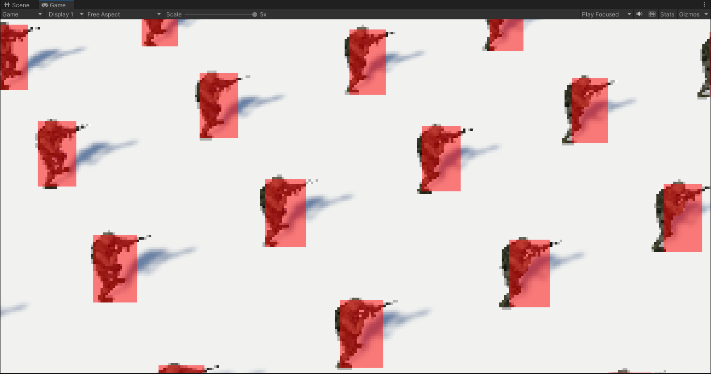

# UnityRectOutline
该库用于计算并**输出**特定物体的识别框，用于和目标检测算法的识别结果比对。

## 概述
- [x] 包含多种计算策略
- [x] 纯CSharp实现：只需要[一个文件](./RectOutlineExample/Assets/Scripts/GetRectOutline.cs)
- [x] 更准确：相比贴合外框的方法，本库更贴合物体（上图右下角的球）
- [x] 高性能：利用了包括缓存、采样等多种方式，在贴合目标的情况下尽可能提升性能
- [x] 可用：支持目标旋转、缩放、位移、播放动作
- [x] Benchmark：配套的用于帮助评估性能的[场景](./RectOutlineExample/Assets/Scenes/Examples/RectOutlineBenchmark.unity)
- [ ] camera剔除
- [ ] 基于数学方法的实现（曲面切平面）
- [ ] 多物体组合框
- [ ] 组渲染：一次性渲染多个Camera的数据
- [ ] 自适应的采样率（基于距离、基于顶点数）
- [ ] 自适应的计算方法
## 如何使用
0. 首先可以尝试[示例](./RectOutlineExample/Assets/Scenes/Examples/RectOutline.unity)
1. 配置物体：对于想要被识别的物体（具备`MeshRenderer`/`MeshFilter`/`SkinnedMeshRenderer`），设置其Tag为`ObjectDetection`。
2. 挂载脚本：将[脚本](./RectOutlineExample/Assets/Scripts/GetRectOutline.cs)挂载到需要输出识别框的Camera
3. 启动
## 参数配置
### Border Type
绘制框的方法，其取值与对应的特点：

| BorderType              | 性能消耗 | 准确性 | 效果图                                                   |
| ----------------------- | -------- | ------ | -------------------------------------------------------- |
| `RENDER_BOUNDS`         | 低       | 较低   |                  |
| `MESH_BOUNDS`           | 较低     | 一般   |                      |
| `MESH_VERTICES`         | 高       | 高     |                  |
| `MESH_VERTICES_SAMPLED` | 一般     | 较高   |  |

- `RENDER_BOUNDS`：
  - 利用Renderer.localBounds计算，是最基础的方法
  - 可以观察到带有动作的士兵的框有偏离，且球的框贴合不紧密
- `MESH_BOUNDS`：
  - 每固定间隔（0.5s），枚举物体mesh的顶点，并缓存其箱体的八个点
  - 士兵框可有效贴合，但球的框仍贴合不紧密
- `MESH_VERTICES`：
  - 每帧枚举物体mesh的顶点，将所有点转换到屏幕坐标系下比较计算
  - 此方法可以确保完全贴合，但性能消耗高
- `MESH_VERTICES_SAMPLED`：
  - 对mesh顶点按间隔进行采样，仅利用部分顶点计算
  - 此方法在**预设参数**的前提下，可以用高于`MESH_VERTICES`数倍速度的情况下，取得接近的效果
  - **在采样点过少时，退化为`MESH_VERTICES`或`MESH_BOUNDS`**
  - 效果不稳定

### Target Tag
默认值为`ObjectDetection`，该值决定了识别场景中的哪些物体。
### Draw UI
是否将框绘制到屏幕上，利用`GUI.DrawTexture`实现。
### Cam
启动时会自动选择绑定GameObject的Camera，也可以自行设置
### Sample Interval
一个正整数，表示对于物体，每n个顶点采样一个用于计算，仅对MESH_VERTICES_SAMPLED生效。
### Sample More Than
最少保留的顶点数，若原始顶点少于这个数量，则不进行采样。

## 性能测试

### 简述
本库中包括了[性能测试场景](./RectOutlineExample/Assets/Scenes/Examples/RectOutlineBenchmark.unity)，这一场景会将一个多顶点物体复制数个，从而协助评估性能。
物体按[正方形螺旋放置](./RectOutlineExample/Assets/Scripts/Examples/GenerateManyAround.cs)，如下图：

测试采用的平台配置：
| 配置项 | 参数            |
| ------ | --------------- |
| CPU    | Intel i7-12700  |
| 内存   | 64GB            |
| GPU    | NVIDIA RTX 3060 |
| Unity  | UnityEditor     |

### 测试结果
| BorderType              | 数量 | fps   | main thread(ms) | SampleInterval |
| ----------------------- | ---- | ----- | --------------- | -------------- |
| -                       | 50   | 411.6 | 2.4             | -              |
| -                       | 100  | 358.9 | 2.9             | -              |
| `RENDER_BOUNDS`         | 50   | 323.1 | 3.1             | -              |
| `RENDER_BOUNDS`         | 100  | 209.6 | 4.8             | -              |
| `MESH_BOUNDS`           | 50   | 271.5 | 3.7             | -              |
| `MESH_BOUNDS`           | 100  | 194.1 | 5.4             | -              |
| `MESH_VERTICES`         | 50   | 11.5  | 87.3            | -              |
| `MESH_VERTICES`         | 100  | 6.0   | 165.4           | -              |
| `MESH_VERTICES_SAMPLED` | 50   | 36.2  | 27.6            | 5              |
| `MESH_VERTICES_SAMPLED` | 100  | 22.5  | 44.5            | 5              |
| `MESH_VERTICES_SAMPLED` | 100  | 30.8  | 32.5            | 10             |
| `MESH_VERTICES_SAMPLED` | 100  | 46.5  | 21.5            | 20             |
| `MESH_VERTICES_SAMPLED` | 100  | 53.7  | 18.6            | 40             |
| `MESH_VERTICES_SAMPLED` | 100  | 62.8  | 15.9            | 80             |

在最后一个测试用例中，实际效果如下：

可以看到此时框缺少了部分轮廓点，因此不再继续测试